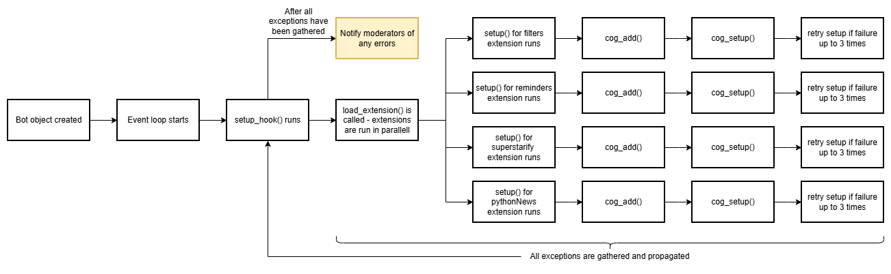

# Report for assignment 4

## Project

Name: Python Utility Bot

URL: [https://github.com/python-discord/bot](https://github.com/python-discord/bot)

A discord bot designed specifically for use with the [Python discord](https://www.pythondiscord.com/) server.
It is built with an extensible cog-based architecture, integrating numerous functionalities, such as moderation, community management, reminders, and many more.

## Architecture and Purpose
The project consists of a Discord bot that provides a wide range of features to support the Python Discord community, such as moderation, filtering, community management, reminders, and much more. The bot is designed to be modular and extensible, with a focus on maintainability.

At its core, the bot operates on an asynchronous event-driven architecture, utilizing Python's `asyncio` library to handle concurrent operations efficiently. The bot's functionality is organized into "cogs", which are modular components that can be loaded, unloaded, and reloaded independently. This design allows for easy maintenance and scalability, as new features can be added without affecting existing functionality. The bot interacts with the Discord API to respond to user commands, manage server events, and integrate with external services. It also incorporates error handling and logging mechanisms using Sentry to ensure reliability and facilitate debugging.

However, there is no simple way for Discord moderators to be notified if a cog fails to load during startup, which can lead to functionality being unavailable without any indication of the underlying issue. This is particularly problematic for cogs that depend on external services, as they may silently fail to initialize if those services are unavailable, and moderators would not be aware of the failure unless they have direct access to the Sentry logs.

This issue is mainly related to a few functions in the main `bot.py` file, which is responsible for loading extensions and cogs during startup, as well as the setup functions in each extension. Figure 1 illustrates the flow of the bot's startup process, highlighting where cog initialization occurs and which exceptions are captured and reported. The diagram also indicates the points at which moderator alerting is integrated in our implementation.




## Onboarding experience

### Did you choose a new project or continue on the previous one?

We chose a new project, mainly as it was difficult to find an existing issue which would meet all the requirements set by the assignment.

### If you changed the project, how did your experience differ from before?

The project is much more complex than the one we chose for assignment 3, which became evident in the amount of time needed with setting up the project environnment, and understanding the codebase.

### Setting up the project

The project setup was documented extremely well in the project's [Contributing guide](https://www.pythondiscord.com/pages/guides/pydis-guides/contributing/bot/).\
Installing the dependencies was straightforward using the `uv` package manager.
Most of the time was likely spent downloading and setting up Docker, particularly for those with no prior experience using it.

In addition to installing dependencies, the project required setting up both the test server and the actual bot and interconnecting them.
This process was also very well documented, and the project even provided a base template for the Discord server, resulting in a very quick setup.

The project documentation also explained how to run the tests, providing a README file containing all the necessary commands.
It included an introduction to writing new tests, along with a brief overview of how mocking is used, which provided some initial insight.

However, the documentation did not include an introduction to the actual codebase.
We spent a significant amount of time trying to understand how the project is structured and how different classes interact with one another.
Because the project is tightly integrated with Discord servers, this made it even more challenging, as some functions are triggered exclusively by the Discord API. For example: It was not possible for us to pass `Status Embed` workflow during continuous integration, as the discord channel id was hard-coded directly in the workflow.
We believe that adding concrete examples or a high-level architectural diagram would be highly beneficial for newcomers.

## Effort spent

Estimated effort per team member, in hours:

| Team member | Plenary discussions / Group meetings | Reading documentation | Configuration and setup | Analyzing code / output | Writing documentation | Writing code | Running code / tests | Total |
| --- | ---: | ---: | ---: | ---: | ---: | ---: | ---: | ---: |
| Apeel | 8 | 3 | 3 | 6 | 3 | 4 | 1 | ~28 |
| Josef | 8 | 2 | 1 | 6 | 4 | 3| 2 | ~26 |
| Alexander | 8 | 2 | 1 | 5 | 2 | 5 | 2 | ~25 |
| Carl | 8 | 2 | 3 | 5 | 2 | 4 | 1 | ~25 |
| Fabian | 8 | 3 | 4 | 5 | 3 | 3 | 1 | ~27 |
| Total | 8 | 12 | 12 | 27 | 14 | 19 | 7 | 99 |

### Dependencies and setup tasks:

| Dependency / tool / setup task | Team member(s) | Time spent | Notes |
| --- | --- | --- | --- |
| Docker | All | 1 | Everyone had locally setup the docker to run the project |
| `uv` and Python environment setup | All | 1  | The given documentation had easy guidelines to setup |
| Discord test server / bot configuration | All | 1 | We all have our own test server and individual bots |


## Overview of issue(s) and work done.

Title: Handling of site connection issues during outage. (#2918)

URL: [https://github.com/python-discord/bot/issues/2918](https://github.com/python-discord/bot/issues/2918)

Since some cogs depend on external services (external sites), their initialization fails if those services are unavailable during startup, rendering their functionality inaccessible.
This failure occurs silently, without any indication to moderators.

Scope (functionality and code affected).

**Functionality affected**
- Startup behavior of cogs depending on external HTTP services.
- Error handling, error propagation.
- Retry logic with back-off.
- Logging and allerting of moderators.

**Code affected**
- `cog_load()` implementations in affected cogs.
- Sentry reporting during individual retries and final error.
- Discord message API interaction to alert moderators.
- Associated unit tests covering cog initialization.
- Extension loading failure handling in `bot.py`
## Requirements for the new feature or requirements affected by functionality being refactored
### FR-1) Resilient Cog Initialization
Cogs that depend on external HTTP services shall handle connection errors and HTTP failures during `cog_load()` without failing silently.
If the external service is unavailable, the cog must not terminate initialization without reporting the failure.
Identified cogs pertaining to this problem are:
- `bot/ext/filtering/filtering.py`
- `bot/ext/utils/reminders.py`
- `bot/ext/info/python_news.py`
- `bot/ext/moderation/infraction/superstarify.py`

### FR-2) Retry Mechanism for External HTTP calls
If a cog fails to initialize due to a retriable HTTP error or network-related exception, the system shall automatically retry the initialization a finite number of times before giving up.
The retry attempts shall use exponential backoff to avoid rapid repeated failures.

**Tested by:**
- `tests/bot/exts/filtering/test_filtering_cog.py::`
   - `test_cog_load_retries_then_succeeds`
   - `test_retries_three_times_fails_and_alerts`
- `tests/bot/exts/utils/test_reminders.py::`
   - `test_reminders_cog_load_retries_after_initial_exception`
   - `test_reminders_cog_load_fails_after_max_retries`
- `tests/bot/exts/info/test_python_news.py::`
   - `test_cog_load_retries_then_succeeds`
   - `test_retries_max_times_fails_and_reraises`
- `tests/bot/exts/moderation/infraction/test_superstarify_cog.py::`
   - `test_fetch_retries_then_succeeds`
   - `test_fetch_fails_after_max_retries`

### FR-3) Error logging and monitoring
All initialization failures shall be logged through the existing logging infrastructure and reported to Sentry.

**Tested by simulating Exception and observing the Sentry output.**

### FR-4) Moderator alert upon failure
If a cog fails to initialize after exhausting all retry attempts, the system shall alert the moderators of the server by sending a message to the `mod-log` Discorrd channel indicating the affected cog and failure description.

**Tested by:**
- `tests/bot/exts/test_extensions.py`

## Code changes

### Patch

The patch can be compared with the `documentation` branch. `documentation` branch only contains report and no changes in the code-base.

```bash
git diff main documentation
```

The patch is clean, as it only contains changes related to handling site connection issues during cog initialization, moderator alerting, and the associated tests/documentation.

The changes were considered for acceptance. All relevant automated checks passed except `Status Embed`. This workflow could not be passed in our local setup because it depends on a hard-coded Discord server channel ID from the official environment, and our test bots do not have permission to send messages to that channel.


## Test results

Before refactoring, cogs depending on unavailable external services could fail during initialization without notifying moderators. Relevant tests for the new retry/alert behavior were not present.

After refactoring, the implemented tests passed when run locally with:

```bash
uv run task test
```

### Output Logs:
- Before Implementation: [Before Output Log](https://github.com/rippyboii/python-bot/issues/21#issuecomment-3977441009)
- After Impementation: [After Output Log](https://github.com/rippyboii/python-bot/issues/21#issuecomment-3977445773)

## UML class diagram and its description

### Key changes/classes affected

Optional (point 1): Architectural overview.

Optional (point 2): relation to design pattern(s).


## Design patterns

The bot follows an *asynchronous event-driven* architecture built on top of asyncio, where the event loop acts as a *Reactor* and the cogs function as *Observers* reacting to events dispatched by Discord. Our update extends this architectural model into the startup phase by making the main bot explicitly await the loading of extensions and cogs. Instead of treating initialization as loosely coordinated asynchronous tasks, startup is now handled as a controlled and deterministic async workflow.

By centrally awaiting extension loading and registering failures, we effectively introduced a structured lifecycle orchestration mechanism. This resembles the *Template Method pattern*; the bot defines the high-level startup algorithm, while individual extensions provide their specific setup behavior. The core now governs execution order, error propagation, and completion, strengthening architectural cohesion and making startup behavior explicit rather than implicit.

The introduction of a centralized failure registry and moderator notification system addresses a reliability concern. Previously, most extension failures were handled locally and silently. Now, error notification is abstracted into one central mechanism which ensures consistent handling and visibility. This can be seen as a *refactoring towards separation of concerns* and consolidation of duplicated logic, improving observability and maintainability without altering the *modular extension design*.

Adding retry logic for critical extensions introduces a resilience pattern into the architecture. Instead of failing permanently, important components now implement retry behavior, aligning with *fault-tolerant design principles*. This change elevates the system from a *fail-fast* startup model to a selectively resilient one, while preserving the modular cog-based structure.

Overall, the update strengthens the architectural maturity of the system. It centralizes lifecycle control, improves separation of responsibilities between the core and extensions, and introduces structured error handling and resilience patterns, all while remaining consistent with the existing asynchronous event-driven and modular design principles.

## Benefits, drawbacks, and limitations (SEMAT kernel)
The primary opportunity addressed by this issue concerns operational reliability.
Previously, cogs that depended on external services would fail silently if those services were unavailable during startup.
Since moderators were not alerted to such failures, functionality could become inaccessible to users without explanation.
The identified opportunity was therefore to improve the robustness of cog initialization and introduce explicit alerting mechanisms so that moderators could take corrective action.
With the implemented changes, this opportunity has moved from identified to addressed, as the Software System has been updated to handle such failures explicitly.

We identified unhandled exceptions in the affected cogs, introduced structured error handling, and implemented a retry-with-exponential-backoff pattern, significantly improving fault tolerance and resilience during startup.
Moderator alerting is handled centrally: a single consolidated message is sent containing all cogs or extensions that failed to load.
This ensures consistent error reporting while avoiding excessive notification noise.
However, the retry mechanism increases the complexity of the startup logic and prolongs initialization time, as the bot completes startup only after all retry attempts have concluded.
This introduces a clear tradeoff between startup latency and system reliability.

From a Requirements perspective, we transformed the previously implicit requirement *cogs should load* into a set of explicit non-functional requirements.
In particular: *cogs should tolerate temporary external service outages*, *failures during cog loading must be observable*, and *startup must not fail silently*.
Additionally, *all startup failures must be reported to moderators*.
These refinements align strongly with reliability and observability as non-functional requirements and make system expectations clearer and verifiable.

The primary stakeholders include moderators/maintainers and server users. With the implemented changes, moderators receive explicit failure notifications, enabling further action to resolve the issues.
Observability is further enhanced through Sentry logging, which records retry attempts and associated error details.
Consequently, users experience fewer unexplained missing features, improving transparency and overall service reliability.

## Overall experience

### What are your main take-aways from this project? What did you learn?

Working on a mature open-source system differs greatly from working on a smaller course project, which is the primary lesson we learned from this project. Even though the setup and contribution guides are well written and provided, understanding the architecture and the interactions between indivdual components and classes takes a significant amount of time.

Technically, we gained more knowledge about cog-based bot architectures, asynchronous Python systems, and how dependencies on outside services can impact startup behavior. One important lesson was that initialization failures shouldn't go unnoticed. Making the system more reliable and user-friendly requires retrying with exponential backoff, clearly documenting errors, and alerting moderators.


### How did you grow as a team, using the Essence standard to evaluate yourself?
We believe we are still in the Collaborating state, however much closer to the Performing state than before.
Throughout the course, we have gradually improved our communication and responsiveness, which has resulted in more active code reviews, frequent discussions about current obstacles and problems, and more structured meeting plans.
The coordination also improved, as we experienced smoother task distribution and better fulfillment of commitments.
However, other courses and external responsibilities still affect our consistency, and the work is therefore fulfilled with varying levels of consistency.


### How would you put your work in context with best software engineering practice?

Our work can be placed in the context of best software engineering practice. The issue we had taken was not only about adding functionality, but about making failure handling more compact in a production-like system that depends on external services. By improving retry behavior, logging, and moderator alerting, we worked toward better observability and fault tolerance, which are important principles in modern software engineering.

Another important aspect of our team was the communication. Throughout the work, we kept the orignal maintainers informed in the issue channel about our understanding of the problem and the our plan of action. This helped to ensure that our approach matched the project expectations and reduced the risk of introducing unintended behavior or potential vulnerabilities. We also communicated directly with the original developers and maintainers of the bot in their official Discord server, which gave us useful clarification and feedback.

Lastly, we provided testing to support the work. We documented known limitations in the test environment, tried to keep the change set restricted to the issue being addressed, and, when feasible, used automated checks to confirm the outcome.

### Is there something special you want to mention here?

It's important to note that while the project's setup documentation was excellent, the codebase's architectural overview was lacking. Understanding how the various components, services, and Discord-specific flows work together was more challenging for new contributors than installing or managing the project. We think that future contributors' onboarding experience would be greatly enhanced by including a higher-level architecture overview.
